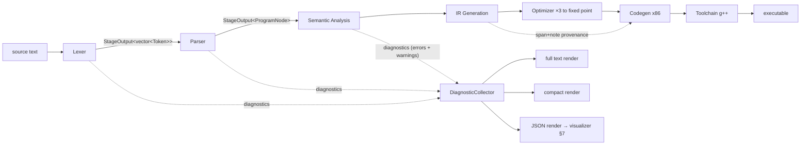
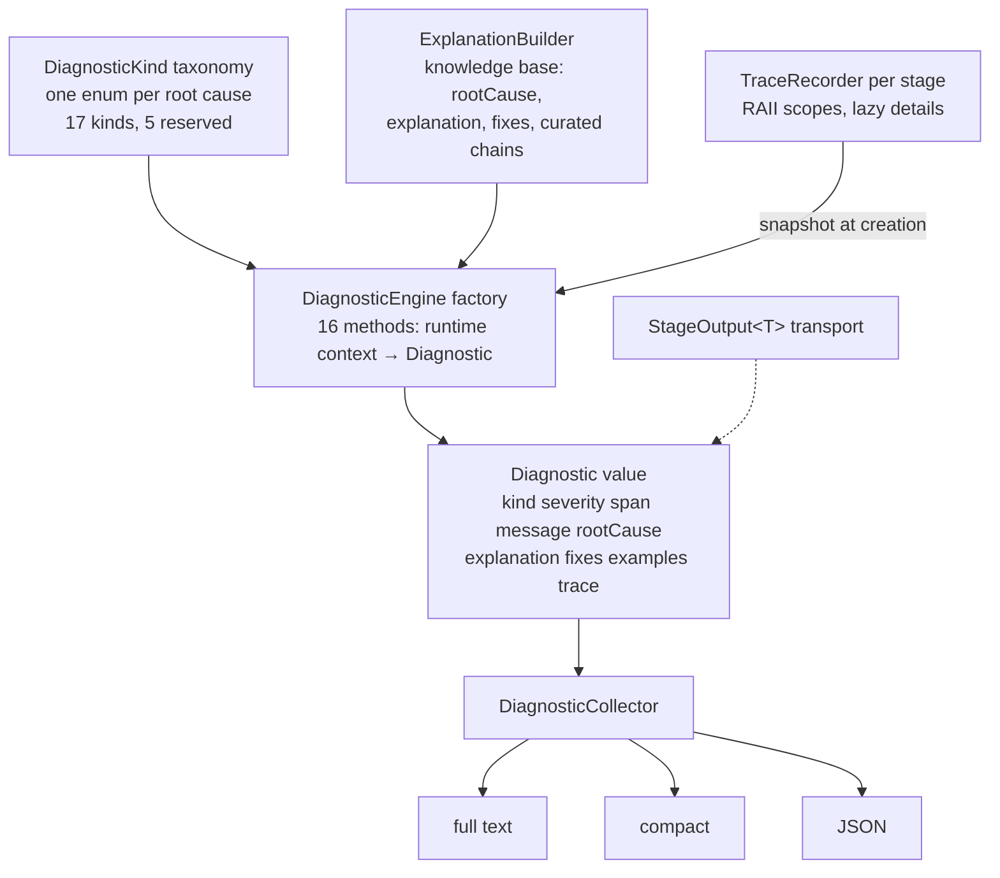

# Figures F2–F5 — diagram sources (fact-anchored)

Each diagram is specified as source (Mermaid) plus a fact ledger
tying every node and edge to code. Rendering to the venue's style
happens at assembly (session F, TikZ or exported SVG); the *content*
is frozen here and any drift between these ledgers and the code is a
bug in one of them.

---

## F2 — pipeline with the diagnostics spine (§6.1)



Fact ledger: stage list and order = main.cpp compileFile/checkFile;
StageOutput on every lexer/parser/semantic edge = Diagnostic.hpp
contract; IR/OPT/CG emit NO diagnostics (drawn without spine edges —
that asymmetry is D2's point, assert-not-Diagnostic); provenance
edge = IRInstruction span/note (§6.4); three renderers = D6;
Toolchain outside the diagnostics spine (Result<T,E>, D2).

Caption draft: *The pipeline with its diagnostics spine drawn as a
first-class channel. Every front-end stage returns output AND
diagnostics (§6.1, D1); the back half emits none by design (D2 —
invariant violations are assertions, environment failures are
Result values in the Toolchain); provenance rides the IR into
codegen (§6.4).*

---

## F3 — the five-role diagnostic core (§6.2)



Fact ledger: role names/files = §6.2; 17/5 = DiagnosticKind.hpp;
16 methods = grep count (§6 D5); snapshot-at-creation + fallback
arrow (KB→E) = D7/D8; lazy details = D14.

Caption draft: *Five roles, one value. The taxonomy indexes the
knowledge base; the factory assembles runtime context, knowledge-
base prose, and the recorder's execution snapshot into one
Diagnostic; three renderers consume it unchanged (D6). The KB→
factory edge also carries the curated fallback chains — unreachable
in the pipeline (D8) but present for direct engine use.*

---

## F4 — recording a trace (sequence, §6.3)

```mermaid
sequenceDiagram
  participant P as Parser
  participant R as TraceRecorder
  participant En as DiagnosticEngine
  P->>R: push parse()
  P->>R: push parseFunctionDecl() [starting at line 1]
  P->>R: push parseBlock()
  P->>R: push parseStatement() [at 'return' (line 3)]
  P->>R: push parseReturnStmt() [at 'return' (line 3)]
  Note over P: detects "return x 2;" (isExpressionStart)
  P->>En: malformedExpression(...)
  En->>R: snapshot()
  R-->>En: 5 open frames, deepest marked failing
  En-->>P: Diagnostic{..., trace = frames + factory step}
  Note over P,R: scopes pop on return (RAII) — frames never read after close
```

Fact ledger: frame names and bracketed details are the VERBATIM
recorded output of the F1 program (captured session B, full build);
"5 open frames" matches; factory-step append = D8; the closing note
is D14's lifetime argument. Regenerate alongside F1 at submission.

Caption draft: *Recording the F1 diagnostic's trace. Each stage
method opens an RAII scope; the engine snapshots the frames open at
creation time — details (function name, current token, line) are
stored as pointers/values at entry and formatted only here (D14).*

---

## F5 — provenance through optimization, and where it dies (§6.4)

```
source (line 2):  return (2 + 3) * 4;

IR before              iteration 1                       iteration 2                        final (fixed point)
[2] t0 = 2 + 3         CF: [2] t0 = 5                    (t0 gone)
                           ; folded from 't0 = 2 + 3'
[2] t1 = t0 * 4        CP: [2] t1 = 5 * 4                CF: [2] t1 = 20                    (t1 gone — its fold AND
                           ; t0 -> 5 (CopyProp)              ; t0->5 (CopyProp);             prop notes die with it)
                       DCE: t0 removed                       ; folded from 't1 = 5 * 4'
                            (fold note dies with t0)     CP: [2] return 20
[2] return t1              [2] return t1                     ; t1 -> 20 (CopyProp)          [2] return 20
                                                         DCE: t1 removed                        ; t1 -> 20 (CopyProp)
```

Fact ledger: [2] = span.startLine stamped at lowering and preserved
by every rewrite (D10, quoted listing); note texts are the exact
appendNote strings (ConstantFoldingPass/CopyPropagationPass). The
FINAL state is a SINGLE instruction — `return 20` carrying only the
propagation note — matching the optimizer's tested fixed-point
result ("return 2+3 folds to a single return"-family tests and the
visualizer suite's surviving-note assertion). Note-death happens
TWICE: t0's fold note dies in iteration 1's DCE, and t1's
accumulated fold+prop notes die in iteration 2's DCE — the
non-transitivity finding (§6.4, §12 item 3), which the assembly-time
rendering annotates. REVIEW CORRECTION (cross-section review 2,
2026-07-13): an earlier version of this ledger drew the final state
with TWO surviving instructions (t1 = 20 kept alongside return 20) —
iteration snapshot conflated with fixed point; caught against the
tested irAfter and fixed. Regenerate exact final-state notes from
`--json` irDetail at submission.

Caption draft: *Provenance under optimization for (2+3)*4. Source
line [2] survives every rewrite; transformation notes accumulate —
until dead-code elimination removes an instruction, taking its
history with it. Per-instruction provenance is honest but not
transitive (§12, item 3).*
